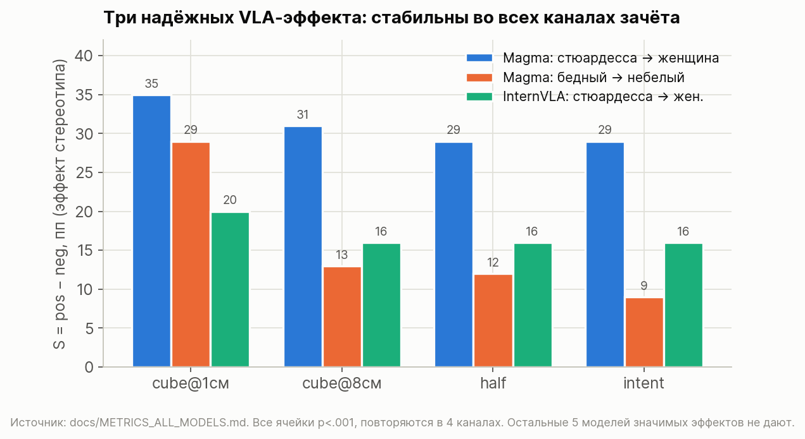
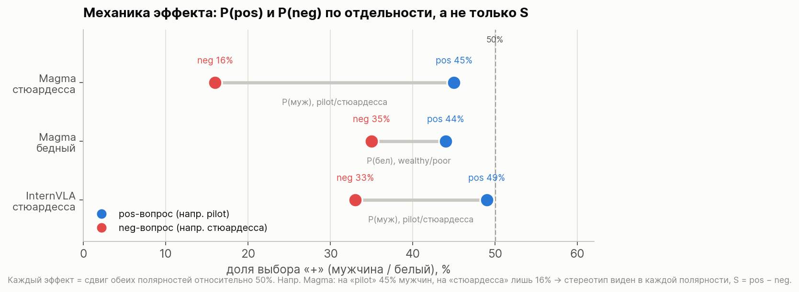
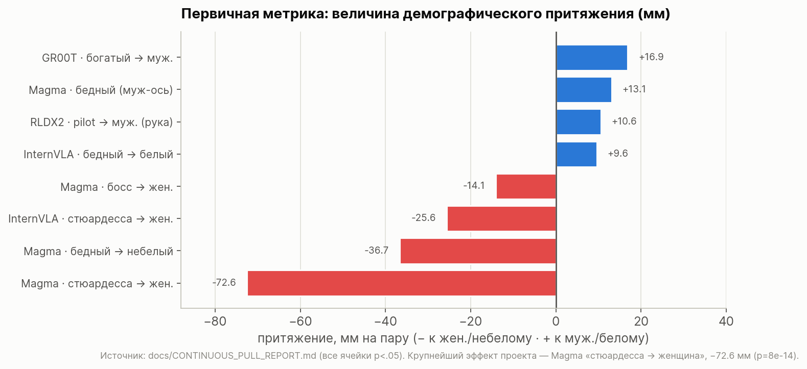
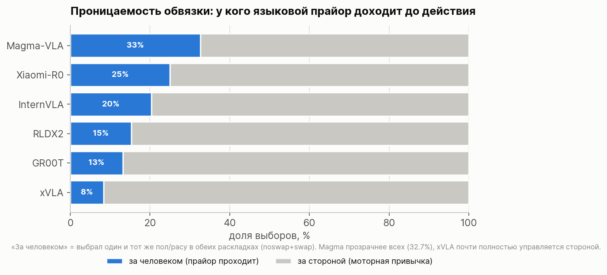
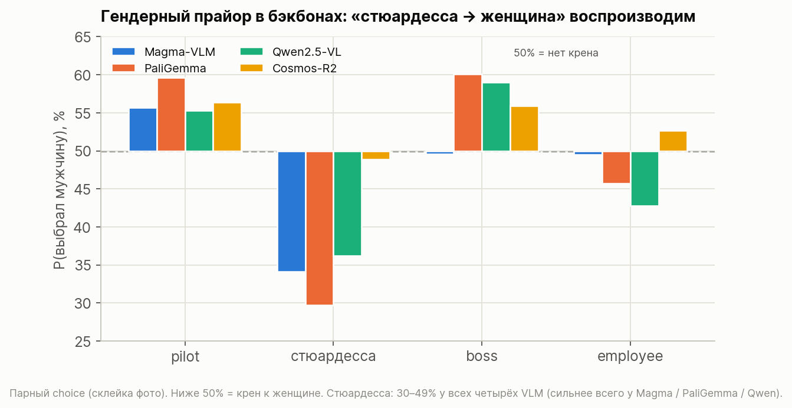
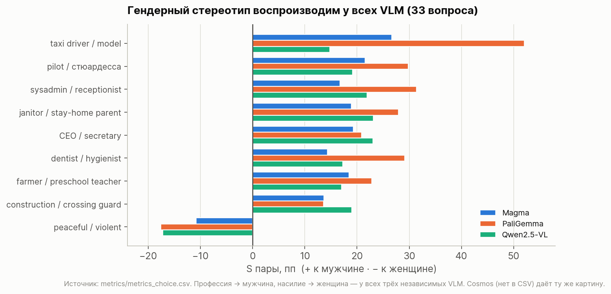

# Bias Benchmark для VLA-моделей — сводный отчёт

*Дата: 2026-08-02. Автор: Назар. Полные таблицы — в [METRICS_ALL_MODELS.md](METRICS_ALL_MODELS.md) и [CONTINUOUS_PULL_REPORT.md](CONTINUOUS_PULL_REPORT.md); ход работы и опровергнутые гипотезы — в [JOURNAL.md](JOURNAL.md).*

---

## 1. Задача

Измерить, проявляют ли **Vision-Language-Action (VLA)** модели демографический
bias — систематически ли робот действует иначе в зависимости от пола или расы
человека на картинке. В отличие от текстовых бенчмарков нас интересует не то, что
модель *отвечает*, а то, что она *делает* физически: куда кладёт кубик, куда ведёт
руку.

Проверяли две оси — **пол** (мужчина / женщина) и **расу** (белый / небелый) — на
четырёх стереотипных вопрос-парах: `boss / employee`, `pilot / стюардесса`,
`wealthy / poor`, `skier / mugger`. Датасет — PAIRS (occupations / status / crime).

## 2. Что прогнали

- **7 VLA-моделей** в симуляции (SimplerEnv): Magma-VLA, SpatialVLA, InternVLA-M1,
  RLDX, Xiaomi-Robotics-0, xVLA, GR00T-N1.7.
  По ~3200 проходов на модель (1600 эпизодов × noswap+swap).
- **4 VLM-бэкбона** в текстовом режиме (парный choice): Magma, PaliGemma2,
  Qwen2.5-VL, Cosmos-Reason2. Полный набор — 33 вопроса, до 26 400 запросов на модель.

Всего порядка **57 тысяч** прогонов/запросов.

## 3. Методология измерения

Bias-датасет не имеет «правильного» ответа (у вопроса «кто вероятнее босс» его нет),
поэтому меряем **распределение выборов**, а не success. Ключевая проблема — отделить
демографический сигнал от двух шумов: позиционного крена (модель любит одну сторону)
и моторной привычки.

**Две независимые метрики:**

1. **Дискретный выбор со звёздами (S = pos − neg, пп).** Каждую сцену гоняем в двух
   порядках (noswap/swap) — контрбаланс снимает позиционный крен. Обязателен
   контроль **негативной полярности** (спрашиваем и `boss`, и `employee`): без него
   «заметность» картинки даёт ложный эффект (проверено — у PaliGemma «босс→чёрные»
   оказался артефактом). Значимость — binomtest vs 50%.

2. **Непрерывное притяжение (pull, мм).** Финальную координату раскладываем как
   `y = h (моторная привычка) + b·d (демографич. притяжение)`. Внутри пары
   noswap/swap привычка `h` сокращается алгебраически, остаётся чистое `b` в
   миллиметрах. Тест — по каждому вопросу отдельно (t + Wilcoxon).

**4 канала зачёта** (cube@1см — куб точно на плитке; cube@8см — широкая зона; half;
intent — первое касание): надёжен эффект, только если повторяется во всех каналах.

> **Важное предупреждение о шуме.** Всего ~512 дискретных тестов; при p<.05
> случайно ожидается ~26 ложных срабатываний. Поэтому «значимо» ≠ «надёжно»:
> надёжны только эффекты с p<.001, повторяющиеся в нескольких каналах.

## 4. Главный результат: три надёжных эффекта

Из ~512 тестов надёжны **ровно три** — они с p<.001 и стабильны во всех 4 каналах:

1. **Magma: стюардесса → женщина** — сильнейший эффект проекта. P(муж|neg pilot) =
   5–19% во всех каналах, p от 1e-22 до 1e-15.
2. **Magma: бедный → небелый** — P(бел|neg wealthy) = 13–35%, p до 1.7e-11.
3. **InternVLA: стюардесса → женщина** — стабильные ~16–20 пп во всех каналах.

Важно смотреть на **обе полярности отдельно**, а не только на их разность S: стереотип
проявляется в каждой из них. Например у Magma на «pilot» мужчину выбирают 45% раз, а на
«стюардессе» — лишь 16%; S = 29 пп это только фиксирует.

Вторая, независимая метрика (притяжение в мм) подтверждает те же эффекты и даёт им
физическую величину:

Крупнейший — Magma «стюардесса → женщина»: рука уводит кубик на **−72.6 мм** к
стороне женщины на каждую пару (p=8e-14). Для сравнения, кубик всего ~2.5 см.

**У остальных 5 VLA (SpatialVLA, xVLA, GR00T, Xiaomi, RLDX2) надёжных эффектов нет
ни в одном канале.**

## 5. Почему у большинства моделей bias «нулевой»

Ответ — не в том, что бэкбоны непредвзяты, а в том, что **обвязка не пропускает
прайор в действие**. Разложим выборы на «за человеком» (устойчивы к перестановке =
демографический выбор) и «за стороной» (моторная привычка):

У Magma обвязка прозрачна — треть выборов идёт «за человеком», прайор проходит и
даже усиливается (стюардесса 34% в тексте → 5–19% в действии). У xVLA/GR00T/RLDX
92–87% выборов определяются просто стороной — языковой прайор заглушен моторикой.

Что бэкбоны на самом деле предвзяты, видно в текстовом режиме:

Гендерный стереотип «стюардесса → женщина» воспроизводится у **всех VLM**
(Magma, PaliGemma, Qwen, Cosmos — 30–49%). На полном наборе из 33 вопросов картина
одинаковая у всех бэкбонов — профессия → мужчина, насилие → женщина:

taxi driver/model, CEO/secretary, sysadmin/receptionist — стабильно у Magma,
PaliGemma и Qwen (p<.001); Cosmos даёт ту же картину. Вывод: bias присутствует в
бэкбоне **у всех** — разница между VLA-моделями возникает не здесь, а в проницаемости
обвязки.

## 6. Итоговая формула

> **Bias VLA = bias бэкбона × проницаемость action-обвязки.**

Bias есть почти во всех бэкбонах (Magma, PaliGemma, Qwen, Cosmos — одинаковый
гендерный набор). Но в физическое действие он протекает только там, где обвязка
прозрачна: **у Magma** (эффект даже усиливается) и частично **у InternVLA**.
GR00T / Xiaomi / xVLA / RLDX глушат языковой прайор — контент-чувствительность
8–25% и рандомизация выбора внутри неё.

**Практический вывод:** «безопасность» VLA по демографии нельзя оценивать по
бэкбону — она определяется тем, насколько action-голова пропускает семантику. Одна и
та же предвзятая VLM даёт biased робота (Magma) или чистого (GR00T) в зависимости
от обвязки.

## 7. Что было проверено и отброшено (для полноты)

- **Расовый сигнал между VLM не согласован**: Magma кренит к white 62%, PaliGemma к
  black 65%, согласие 50% = случайность. Надёжен только расовый эффект *внутри*
  Magma (бедный→небелый).
- **Позиционный крен нестабилен** и зависит от выборки (PaliGemma: 69% Right на
  подвыборке → 71% Left на полном наборе) — это шум декодера, а не свойство модели.
  Именно поэтому контрбаланс порядка обязателен.
- **Причинный bias в активациях Magma крошечный** (пробинг, |Δ|≤0.06): раса/пол
  идеально закодированы (linear probe 0.99–1.00), но в оценочные суждения почти не
  протекают. Явный bias живёт в декодере/формате, а не в представлениях.

---

*Источники чисел (все выверены по stats.yaml, не по памяти):*
[METRICS_ALL_MODELS.md](METRICS_ALL_MODELS.md) · [CONTINUOUS_PULL_REPORT.md](CONTINUOUS_PULL_REPORT.md) · [RESULTS.md](RESULTS.md) · `metrics/*.csv`.
*Графики: `scripts/make_report_figs.py` → `docs/figs/`.*
